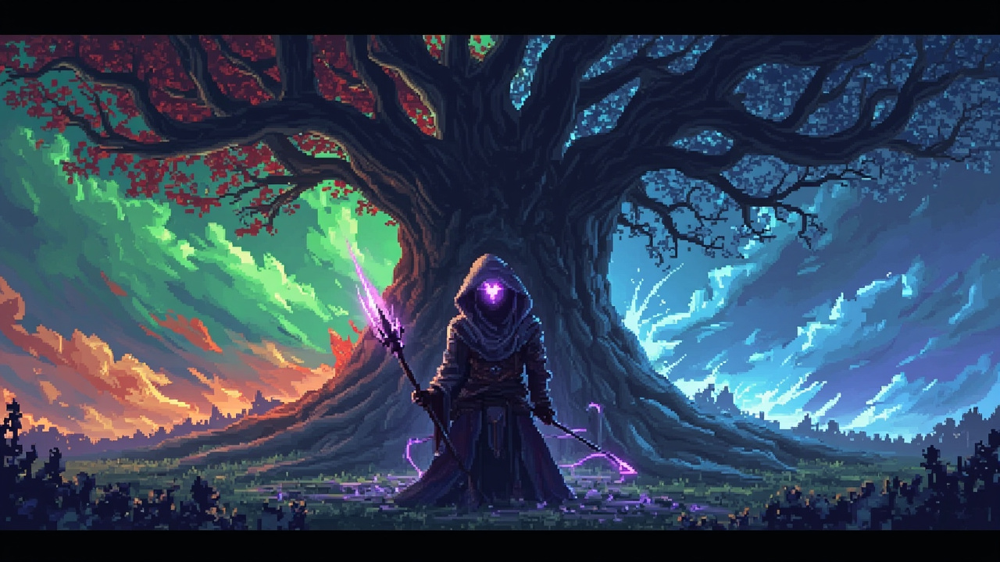
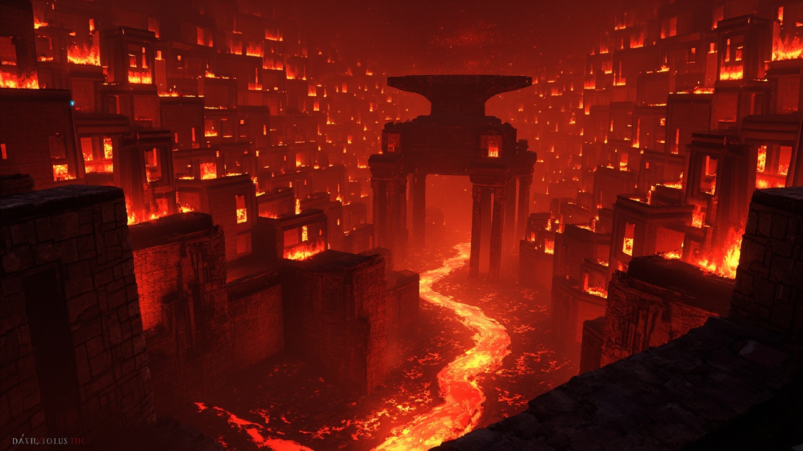
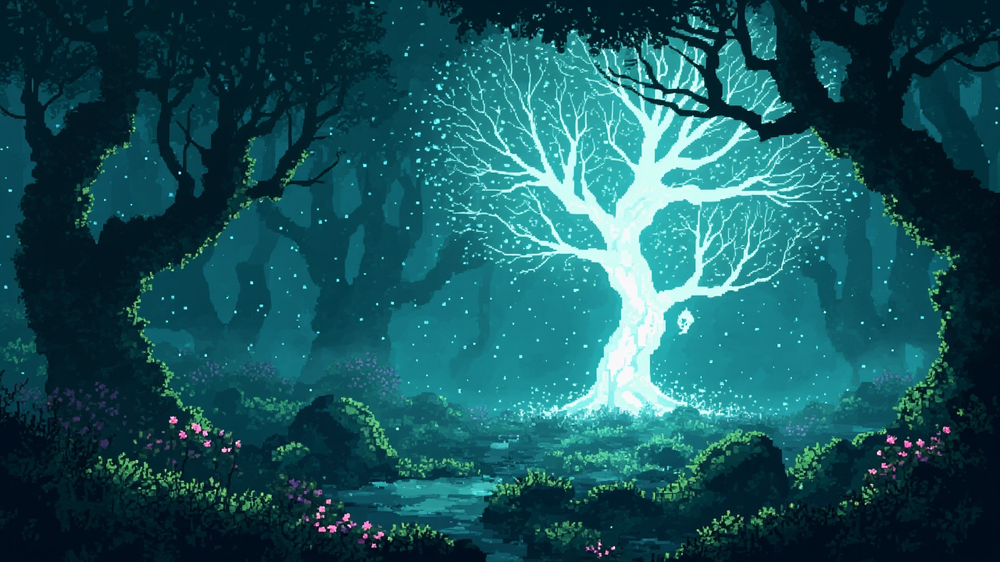

<div align="center">

# 回声 · 枯荣之环
### ECHOES · THE WITHERBLOOM CYCLE

**一款无引擎、纯手写 Canvas 2D 的像素风动作 RPG。**

> 不打破循环 —— 走进寂渊的记忆,让他自愿被世人重新记起。




</div>

---

## 玩什么

远古之时,七位「根者」把世界植入王树,以四时循环维系万物。被遗忘的第七位 —— **寂渊的回声** —— 撕开了循环,把四个季节折成一个互相嵌套的环。你扮演失去名字的「回响者」,被王树最后一片落叶召唤而来。

这不是一个"杀死最终 BOSS 拯救世界"的故事。**每一章的 BOSS 都是被困在自身悔恨中的古老存在**——你可以打败他们,也可以满足隐藏条件后「释怀」他们:走进他们的记忆,和平通关。

| 章节 | 主题 | 情绪 |
|:---:|:---|:---:|
| 第一章 · 春之森 | 王树苗圃 / 苔藓村庄 / 回声湖 | 醒来 |
| 第二章 · 夏之墟 | 锻炉城 / 黄昏斗技场 / 太阳王座 | 燃烧 |
| 第三章 · 秋之墓 | 无名墓园 / 倒悬学院 / 永恒阶梯 | 埋葬 |
| 第四章 · 冬之渊 | 寒铁桥 / 镜湖 / 寂渊之心 | 和解 |

目标游玩时长 **2.5 – 3.5 小时**;开局从三种回响倾向中选择:**追忆者**(魔法)、**锻体者**(近战)、**织梦者**(节奏)。

---

## 特色

**双线通关** — 每章 BOSS 可击败、可释怀。释怀有真实前置:第二章要先把守林人的摇篮曲交给焚身王的女儿,第三章要先在墓园为寂渊立一块无名碑。两条线通向不同的结局。

**局内构筑** — Hades 式祝福三选一:普通 / 稀有 / 史诗 / 职业形态四档,带保底(pity)计数;精英击杀、试炼房、记忆石阵都会触发。死亡失去最高稀有度的一枚祝福,局外资产全保留。

**程序生成地牢** — 每章按列划分三个主题区域(专属怪物组 / 房名 / 装饰 / 色调),flood-fill 校验连通;试炼 / 宝藏 / 静谧三种支线岔路;两种门控:集刻印开 BOSS 封印门,花碎片共鸣开宝藏房的回响封印;第三章还有按季节顺序踏亮的记忆石阵。

**战斗手感** — 三段连击链、hitstop 命中停顿、trauma 屏震、完美闪避子弹时间 + 回蓝、攻击/闪避预输入缓冲、精英三词缀(狂热 / 爆裂 / 守御)、刻印守护战伏击。

**程序化 8-bit 音频** — 全部音效与六首 BGM 由 WebAudio 振荡器实时合成(lookahead 精确调度),无音频文件;三总线音量、配音自动压低 BGM(ducking)、切曲淡入淡出、主输出限幅;BOSS 台词配 TTS 预生成语音。

**四合一输入** — 键盘、鼠标精瞄、触屏虚拟摇杆、手柄(摇杆 + 全按钮映射),任意设备即开即玩;屏震 / 闪光可关闭的无障碍选项。

<details>
<summary><b>截图(章节过场插画)</b></summary>

| | |
|:---:|:---:|
|  |  |
|  |  |

</details>

---

## 快速开始

```bash
git clone https://github.com/Deyu008/witherbloom-cycle.git
cd witherbloom-cycle
npm install        # 仅 dev 依赖(esbuild / 测试用 canvas)
npm run serve      # 打开 http://localhost:8000
```

零构建即可玩:`src/main.js` 以 ES Module 直接加载。想发布单文件版本:

```bash
npm run build        # 产出 dist/game.js(页面自动优先加载,失败回退 src/)
npm run build:prod   # 压缩版
```

任何静态服务器都行(`python3 -m http.server` 亦可);不支持 `file://` 直开(模块跨域限制)。

## 操作

| 动作 | 键盘 / 鼠标 | 手柄 | 触屏 |
|:---|:---|:---|:---|
| 移动 | WASD / 方向键 | 左摇杆 / 十字键 | 左半屏虚拟摇杆 |
| 攻击(自动瞄准) | J / 鼠标左键 | A | 右下区域 |
| 闪避(无敌帧) | Space | Y | 右上区域 |
| 技能 追忆 / 枯荣之护 / 回响共鸣 | Q / E / R | LB / RB / RT | 底排按钮 |
| 晨露(回血) | F | LT | 底排按钮 |
| 互动 / 交谈 / 共鸣封印 | T | X | 底排按钮 |
| 释怀 BOSS | V | — | — |
| 帮助 / 暂停 / 静音 | ? 或 H / ESC / M | Start / B | — |

只用 **WASD + J + Space** 就能通关 —— 自动瞄准与罗盘指引覆盖全程;鼠标与手柄是可选的精确操作。

---

## 技术架构

**~12,500 行手写 Canvas 2D,53 个 ES 模块,零运行时依赖。** 没有引游戏引擎 —— 渲染、物理(分离轴瓦片碰撞)、动画、音频、场景管理全部自建,换来的是对每一帧的完全控制。

```
src/
├── main.js / boot.js / game.js    # 入口、启动器、主循环与场景调度
├── player.js / enemy.js / boss.js # 玩家(三职业)、敌人 AI、BOSS 状态机
├── world.js                       # 地牢生成、连通性校验、离屏地图烘焙
├── camera.js / input.js           # trauma 屏震相机 / 四合一动作映射
├── audio.js / particles.js        # WebAudio 合成引擎 / 对象池粒子
├── menuNav.js / uiKit.js / fxCache.js   # 统一菜单导航 / UI 组件 / 光晕预烘焙
├── data/                          # 章节数据、区域主题、平衡数值、祝福池、剧本
├── scenes/                        # 13 个场景(标题/章节/游戏/对话/商店/…)
└── sprites/                       # 像素精灵(程序生成 + mmx 生成图)
```

值得一看的实现:

- **整图离屏烘焙** — 静态地图(地面 / 墙体描边 / 装饰 / hazard)预渲染成一张离屏 canvas,每帧单次 `drawImage` blit,配合视口剔除。
- **稳态零分配** — 弹幕与粒子走对象池,尾迹点复用,热路径用标量坐标接口取代 `{x,y}` 分配,列表清理全部写指针原地压缩;30fps 设备上摩擦按秒衰减,手感不漂移。
- **WebAudio lookahead 调度** — 25ms 心跳把音符预约到音频时钟,后台标签页自动放大预约窗口抗节流。
- **216 项回归测试** — 状态合并、存档、地牢生成连通性、瞄准选择、战斗手感、对象池复用,全部 node 直跑无需浏览器。

## 开发

```bash
npm test            # 216 项回归(smoke / state / runtime / aim / combat)
npm run serve       # 本地开发服务器
npm run build       # esbuild 打包 → dist/game.js
npm run build:prod  # 压缩打包
```

设计文档见 [`docs/01-story.md`](docs/01-story.md)(世界观 / 章节结构 / 双线结局设计稿)。

## 路线图

- [ ] 执念值双条系统(把"释怀"从低血按键变成一套构筑玩法)
- [ ] 回响树向 12–16 节点扩张,每级实效
- [ ] 祝福协同组合与跨章桥接
- [ ] 第二章斗技场事件、第四章悔恨三门
- [ ] itch.io 发布(HTML5)

## 致谢

- 美术与 BOSS 配音由 [MiniMax](https://www.minimax.io/) 生成
- 设计语言致敬 *Hollow Knight*、*Hades*、*Blasphemous*、*Hyper Light Drifter*

## 许可

© 2026 Deyu Yang · 保留所有权利。

代码与美术 / 音频内容默认未授权转载与二次分发;如果你想在作品中使用部分内容、或希望本项目改用开源许可,欢迎联系。

